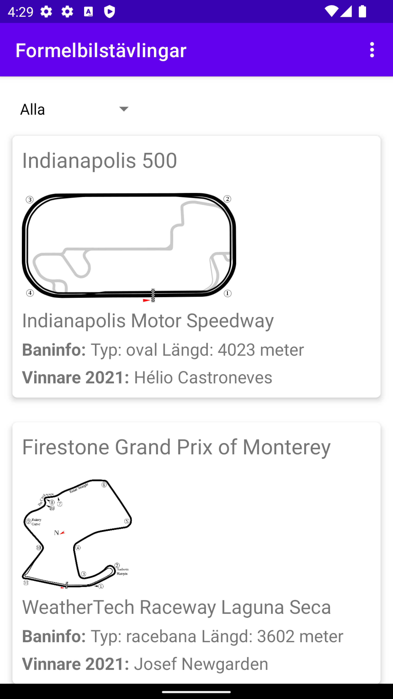
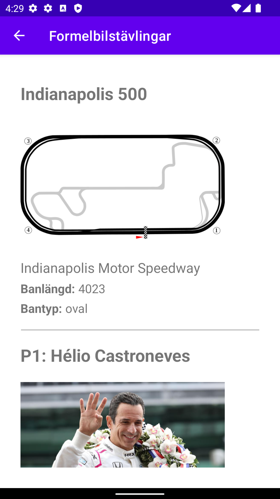
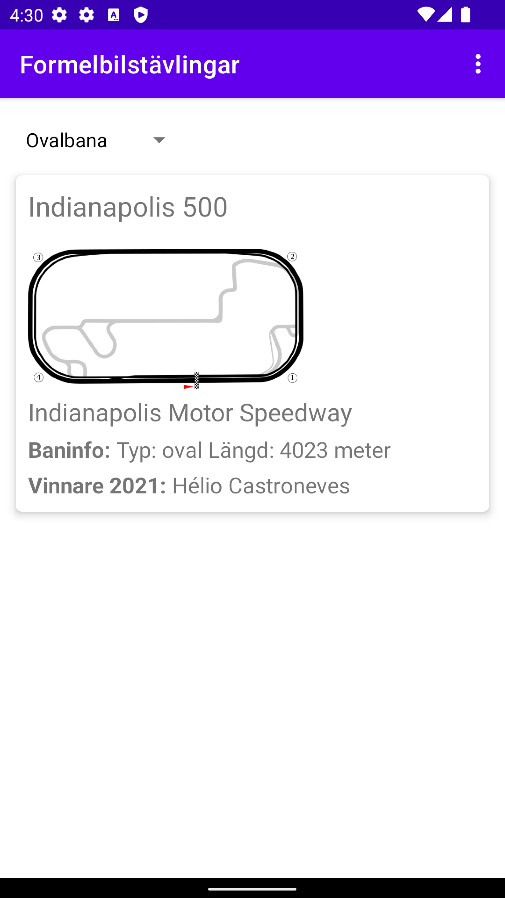

## Om Appen
Denna app är slutprojektet i kursen Programmering av mobila applikationer G1F, 7,5 hp. 
Namnet på appen är formelbilstävlingar, just eftersom den har i uppgift att visa information om några av de största tävlingarna. 
Appen består till mestadels av en Recycler View som får sin data från JSON (figur 1.1). Reycler Viewns innehåll består av 
Card Views som agerar knappar och vid klick tar en vidare till en mer detaljerad vy som är en ny aktivitet som skapas utifrån en 
intent med intentdata (extras). Även sidan i menyn som kallas sig för om appen är skapad med hjälp av en intent och en WebView. 
Nedan följer först en mer detaljerad beskrivning av applikationens funktioner och sedan en beskrivning av vad för kod som använts 
för att skapa dessa funktioner.

```
[
  {
    "ID": "bana-indianapolis",
    "name": "Indianapolis Motor Speedway",
    "type": "c21alest",
    "company": "Indianapolis 500",
    "location": "Indianapolis, Indiana, USA",
    "category": "oval",
    "size": 4023,
    "cost": 0,
    "auxdata": {
      "img": "https://upload.wikimedia.org/wikipedia/commons/thumb/6/6e/Indianapolis_Oval.svg/640px-Indianapolis_Oval.svg.png",
      "ow21": "Hélio Castroneves",
      "dimg": "https://imageio.forbes.com/specials-images/imageserve/60b912afbc99659e94e3f025/105th-Running-Of-The-Indianapolis-500---Winner-s-Portraits/960x0.jpg?fit=bounds&format=jpg&width=960",
      "age": "47",
      "nat": "Brasilien"
    }
  },
  {
    "ID": "bana-laguna_seca",
    "name": "WeatherTech Raceway Laguna Seca",
    "type": "c21alest",
    "company": "Firestone Grand Prix of Monterey",
    "location": "Monterey, Kalifornien, USA",
    "category": "racebana",
    "size": 3602,
    "cost": 0,
    "auxdata": {
      "img": "https://upload.wikimedia.org/wikipedia/commons/thumb/5/57/Laguna_Seca.svg/1280px-Laguna_Seca.svg.png",
      "ow21": "Josef Newgarden",
      "dimg": "https://beyondtheflag.com/wp-content/uploads/getty-images/2022/04/1390745872.jpeg",
      "age": "31",
      "nat": "Tennessee, USA"
    }
  },
  {
    "ID": "bana-long_beach",
    "name": "Long Beach Grand Prix",
    "type": "c21alest",
    "company": "Acura Grand Prix of Long Beach",
    "location": "Long Beach, Kalifornien, USA",
    "category": "stadsbana",
    "size": 2100,
    "cost": 0,
    "auxdata": {
      "img": "https://upload.wikimedia.org/wikipedia/commons/thumb/7/72/Long_Beach_Street_Circuit_IndyCar.svg/1920px-Long_Beach_Street_Circuit_IndyCar.svg.png",
      "ow21": "Josef Newgarden",
      "dimg": "https://beyondtheflag.com/wp-content/uploads/getty-images/2022/04/1390745872.jpeg",
      "age": "31",
      "nat": "Tennessee, USA"
    }
  },
  {
    "ID": "bana-monaco",
    "name": "Circuit de Monaco",
    "type": "c21alest",
    "company": "Monacos Grand Prix",
    "location": "Monte Carlo, Monaco",
    "category": "stadsbana",
    "size": 3337,
    "cost": 0,
    "auxdata": {
      "img": "https://upload.wikimedia.org/wikipedia/commons/thumb/3/36/Monte_Carlo_Formula_1_track_map.svg/1920px-Monte_Carlo_Formula_1_track_map.svg.png",
      "ow21": "Max Verstappen",
      "dimg": "https://boardroom.tv/wp-content/uploads/2022/03/GettyImages-1211696969-e1646244913198-1280x720.jpg",
      "age": "24",
      "nat": "Nederländerna"
    }
  },
  {
    "ID": "bana-spa",
    "name": "Circuit de Spa-Francorchamps",
    "type": "c21alest",
    "company": "Belgiens Grand Prix",
    "location": "Liège, Belgien",
    "category": "racebana",
    "size": 7004,
    "cost": 0,
    "auxdata": {
      "img": "https://upload.wikimedia.org/wikipedia/commons/thumb/5/54/Spa-Francorchamps_of_Belgium.svg/2560px-Spa-Francorchamps_of_Belgium.svg.png",
      "ow21": "Max Verstappen",
      "dimg": "https://boardroom.tv/wp-content/uploads/2022/03/GettyImages-1211696969-e1646244913198-1280x720.jpg",
      "age": "24",
      "nat": "Nederländerna"
    }
  }
]
```
URL: https://mobprog.webug.se/json-api?login=c21alest

_Figur 1.1 JSON Data_

# Förklaring
## Förstasidan
Varje gång du öppnar appen kommer ett antal race att dyka upp. Vad som visas beror på vilken
filtrering du gjorde senast du stängde appen eftersom detta sparas. Du kan alltid byta detta genom dropdownen som
 finns längst upp till vänster. För att veta mer om ett race klickar du på kortet.




## Detaljerad vy
<p>När du klickat på det kort du vill veta mer om visas en nya aktivitet likt bilden nedan. Här kan du
skrolla på skärmen för att visa allt innehåll som finns tillgängligt om det specifika racet. Bland annat kan du här
se en bild på föraren som du inte kunde i tidigare vy.</p>




## Filter
<p>Om du önskar att filtrera racen är det möjligt med dropdown. Du har där 3 alternativ, antingen visas
bara ovalbanor, stadsbanor, eller racebanor. När du klickar på någon av dessa kommer innehållet att uppdateras. Om
du väljer oval kommer det att se ut likt bilden nedan:</p>




## Video som visar hur appen funkar:


# Lösning
## Recycler viewn på Förstasidan
För att visa allt innehåll på förstasidan används en Recycler View i kombination med Card View, där Recycler Viewn
visar upp allt innehåll som finns i JSON Datan och Card Viewn är en typ av styling från ett externt bibliotek.

En recycler view gör det möjligt att dynamiskt visa innehåll. Det vill säga att presentera data oberoende av dess längd och storlek. 
För att skapa en recycler view krävs ett antal olika komponenter, där de största är en adapter, view holder och en layout manager. 
Adaptern är den huvudsakliga komponenten som presenterar all data medan en view holder tar hand om varje individuellt element medan 
layout manager arrangerar alla dessa element.

Först av allt skapades en instans av dessa komponenter, kod för detta syns nedan. Man börjar med att skapa de olika variablerna. 
myAdapter blir kopplat mot MainAdapter eftersom java redan vet att det kommer vara en recycler view.
När detta är gjort länkas recyclerviewn mot ett id i layouten där datan kan presenteras. Efter det länkas layout managern till den 
tidigare variabeln som skapades. Sen skapas och kopplas adaptern och här specificeras den data vi vill skicka med, i detta fall kommer en list
som JsonTask skapats (pratas om längre ner) att skickas med. Slutligen kopplar man både adaptern och layout managern till recycler viewn.

```
    RecyclerView myRecyclerView;
    MainAdapter myAdapter;
    LinearLayoutManager myLayoutManager;
    
    List<gp> gpinfo;
    private gp[] gpInfo;
    
    (...)
    
        // Skapar en recycler view instans
        myRecyclerView = findViewById(R.id.recycler_view);
        // Optimerings parameter
        myRecyclerView.setHasFixedSize(true);

        myLayoutManager = new LinearLayoutManager(this);
        myRecyclerView.setLayoutManager(myLayoutManager);
        myAdapter = new MainAdapter(gpinfo, this, sort);
        myRecyclerView.setAdapter(myAdapter);
```
_Figur 2.2 Kod för att instansera en Recycler View och dess komponenter_

Men nu har gpinfo som skickas med i adaptern bara deklarerats men aldrig initieras med någon data därför kommer recycler viewn att vara tom.
Och för att lägga in data i gpinfo görs detta efter att JsonTask är klar, vilket innebär att OnPostExecute kommer att körs. Där kan vi alltså
använda oss av en setter och funktionen notifyDataSetChanged för att uppdatera information i recycler viewn, kod för detta syns nedan. Settern
gör just vad det låter som alltså att sätta ett värde på datan, alltså som en transport väg för att skicka data ifrån MainActivity till main adapter.
Sedan gör notifyDataSetChanged att adaptern blir notifierad om att den ska uppdatera recycler viewn.

```
    @Override
    public void onPostExecute(String json) {
        Log.d("==>", json);

        // Skapar gson instans från json fil och mountain klass
        Gson gson = new Gson();
        gpInfo = gson.fromJson(json, gp[].class);

        gpinfo = Arrays.asList(gpInfo);

        myAdapter.setRaces(gpinfo, sort);
        myAdapter.notifyDataSetChanged();

    }
```
_Figur 2.3 Kod för att uppdatera Recycler Viewn_

Det finns också en java klass men olika setters för varje sträng i JSON filen som senare kommer användas av gson
för att skapa objekt, kod för detta syns i figur 2.4.

```
public class gp {
    private String ID;
    @SerializedName("name")
    private String track_name;

(...)

    public String getID() {
        return ID;
    }

    public String getTrackName() {
        return track_name;
    }

```
_Figur 2.4 Kod för att hantera JSON i objekt_

## Reycler View Adapter och View Holder
När man har instansierat recycler viewn behöver adaptern skapas. 
Detta görs i en egen klass där tre huvudsakliga metoder skapas nämligen onCreateViewHolder, onBindViewHolder, getItemCount. 
Där onCreateViewHolder just skapar en view holder så länge ingen annan existerar. 
Och onBindViewHolder tar hand om de olika vyerna som skapas, en recycler view har i uppgift att vara ett mer effektiv sätt att 
hantera vyer genom att återanvända dem och inte visa alla samtidigt, just för att spara minne, och denna metod hanterar dessa vyer. 
Metoden getItemCount är simpel och berättar just hur många objekt som finns. I dessa olika metoder kan man sedan specificera vad som 
exakt ska hända.

```
    @NonNull
    @Override
    public MainAdapter.ViewHolder onCreateViewHolder(@NonNull ViewGroup parent, int viewType) {
        // Skapar en ny view för list_items som används för att presentera innehåller i recycler view
        View view = LayoutInflater.from(parent.getContext()).inflate(R.layout.list_items, parent, false);
        return new ViewHolder(view);
    }

    @Override
    public void onBindViewHolder(@NonNull MainAdapter.ViewHolder holder, int position) {

    }

    @Override
    public int getItemCount() {
        // Om raceSorted är null returera 0 annars värdet
        return racesSorted == null ? 0 : racesSorted.size();
    }
```

_Figur 3.1 Kod för Recycler View Adaptern_

Och slutligen skapas View Holdern:

```
    public class ViewHolder extends RecyclerView.ViewHolder {

        public TextView textD;

        public ViewHolder(@NonNull View itemView) {
            super(itemView);

            // Kopplar variabel mot id i en layout
            textD = itemView.findViewById(R.id.display_text);
        }
    }
```
_Figur 3.2 Kod för View Holder_

## Innehållet i Recycler Viewn
Som tidigare beskrivit är det onBindViewHolder som bestämmer vad för data som ska visas. Just för denna uppgift används den kod som syns
i figur 2.5. Här kan man se att texten sätts för en mängd olika textviews, dessa textviews är refererade i View Holdern som syns i figur 2.6.
Dessutom används biblioteket Picasso som gör det möjligt att visa bilderna från en url. Och med hjälp av ett par olika parametrar kan 
måtten bestämmas.

```
    @Override
    public void onBindViewHolder(@NonNull MainAdapter.ViewHolder holder, int position) {
        holder.title.setText(racesSorted.get(position).getGpName());
        Picasso.get().load(racesSorted.get(position).getAuxdata().getImg()).resize(0, 300).into(holder.trackOverview);
        holder.trackName.setText(racesSorted.get(position).getTrackName());
        trackInfo = "Typ: " + racesSorted.get(position).getTrackType();
        trackInfo += " Längd: " + racesSorted.get(position).getTrackLength() + " meter";
        holder.trackInfo.setText(trackInfo);
        holder.gpWinner.setText(racesSorted.get(position).getAuxdata().getOw21());

    }
```
_Figur 4.1 Kod för widgets_

```
        public ViewHolder(@NonNull View itemView, OnButtonListner onButtonListner) {
            super(itemView);

            // Kopplar variabel mot id i en layout
            title = itemView.findViewById(R.id.title);
            trackName = itemView.findViewById(R.id.track_name);
            trackInfo = itemView.findViewById(R.id.track_info);
            gpWinner = itemView.findViewById(R.id.winner_name);
            trackOverview = (ImageView) itemView.findViewById(R.id.track_overview);
            this.onButtonListner = onButtonListner;

            itemView.setOnClickListener(this);
        }
```
_Figur 4.2 Kod för TextViews_

## Filter
Appen har också möjligheten att applicera ett filter, vilket innebär att enbart oval, race eller stadsbanor visas och de andra filtreras ut.
Denna processen var lite mer utmanade och krävdes att ett värde för vad som ska sorteras skickas med i adaptern. Lösningen är att en så kallad spinner används
som kan beskrivas som en dropdown, koden för denna syns i figur 5.1. Den har sedan en så kallad switch som kollar efter olika händelser som i detta fallet är
de olika alternativen (figur 5.2), och när något alternativ väljes ändras värdet på en variabel. Sedan körs en annan funktion som kör JsonTask igen och slutligen notifierar adaptern
om ny data. Sedan används shared preferences för att bevara valet trots att appen avslutas, detta syns i figur 5.3.

```
            // Shared preferences för att bevara det filter som valdes
            private void saveSpinnerState() {
                int Choice = dropdown.getSelectedItemPosition();
                SharedPreferences sharedPref = getSharedPreferences("dropdown",MODE_PRIVATE);
                SharedPreferences.Editor prefEditor = sharedPref.edit();
                prefEditor.putInt("spinnerState",Choice);
                prefEditor.commit();
            }
```
_Figur 5.1 Kod för Spinner/Dropdown_

```
        dropdown.setOnItemSelectedListener(new AdapterView.OnItemSelectedListener() {
            @Override
            public void onItemSelected(AdapterView<?> parent, View view, int position, long id) {
                // Olika saker pga alternativ i dropdown
                switch (position) {
                    case 0:
                        Toast.makeText(parent.getContext(), "Visar alla", Toast.LENGTH_SHORT).show();
                        sort = null;
                        break;
                    case 1:
                        Toast.makeText(parent.getContext(), "Visar endast ovalbanor", Toast.LENGTH_SHORT).show();
                        sort = "oval";
                        break;
                    case 2:
                        Toast.makeText(parent.getContext(), "Visar endast stadsbanor", Toast.LENGTH_SHORT).show();
                        sort = "stadsbana";
                        break;
                    case 3:
                        Toast.makeText(parent.getContext(), "Visar endast racebanor", Toast.LENGTH_SHORT).show();
                        sort = "racebana";
                        break;
                }
                saveSpinnerState();
                changeReyclerView();
            }
```
_Figur 5.2 Kod för switch till dropdown_

```
        // Ställer in sparat filter i on create
        SharedPreferences sharedPref = getSharedPreferences("dropdown",MODE_PRIVATE);
        int spinnerValue = sharedPref.getInt("spinnerState",-1);
        if(spinnerValue != -1)
            dropdown.setSelection(spinnerValue);
```
_Figur 5.3 Kod för shared preferences_

### Filter i adapter
Vad som möjliggör att filtret fungerar, och inte bara att ett värde sätts som beskrivit tidigare, syns i figuren 6.1 nedan. Funktionen setFilter använder sig av
den tidigare sort variabeln men som nu istället benämns sortItem. Vad som händer är att denna funktion körs så länge inte data är tom. Den data finns så ittererar den
genom varje objekt som beskrivs av listans längd. Och om ett visst värde i den positionen instämmer med filtret behålls den. Ett exempel är om filter oval skulle användas
då jämför denna funktionen strängen oval med vad som finns i getTrackType som antingen kan vara oval, racebana, eller stadsbana. Och om detta är sant kommer den att bevaras
efter den ska visas. Alla andra som inte stämmer överens tas bort från listan. Men eftersom inte positionen och indexen kommer stämma efter varje ittering pågrund
av att listan blir mindre håller integer variabeln indexToDelete koll på detta. Efter detta steg kommer vi ha en ny lista som bara innehåller den önskade datan.
Samtidigt så formas en annan array som kommer att berätta för den senare OnButtonListener vad för objekt som finns kvar i listan efter att filtret har gjorts, detta
behövs eftersom klick lyssnaren finns i en annan java klass, nämligen MainActivity.

```
    public void setFilter() {
        if (races != null) {
            racesSorted = new ArrayList<>(races);
            choosen = new ArrayList<>();

            // Raderar de värden som inte ska visas utifrån dropdown filter
            int indexToDelete = 0;
            for (int i = 0; i < races.size(); i++) {
                // Kollar typen på banan i varje index
                String trackType = races.get(i).getTrackType();

                // Om bantyp ska visas i filter ökas indexToDelete för att den inte ska radera denna
                if (Objects.equals(trackType, sortItems)) {
                    indexToDelete++;
                    Log.d(TAG, "MainAdapter: " + trackType);
                    choosen.add(races.get(i).getID());
                    showItem = true;
                }
                // Om sortItems är null betyder det att filtret ska visa allt
                else if (sortItems == null) {
                    choosen.add(races.get(i).getID());
                    showItem = true;
                }
                // Om inte bantypen stämde överens med filter tas den bort
                else {
                    // Kan inte radera i (for loop) eftersom RacesSorted alltid kommer minskas i storlek!
                    racesSorted.remove(indexToDelete);
                }
            }
        }
    }
```
_Figur 5.4 Kod för filter i adapter_

## onButtonClick
För att skapa den mer detaljerade vyn finns en OnButtonListener i adpatern och i view holdern där interfacet syns i figur 6.1 nedan. Med hjälp av denna skapas en
klick lyssnare i varje Recycler View som sedan triggar funktionen onButtonClick i MainActivity. datan som skickas med är positionen för att veta exakt vilket
recyclerview föremål som klickats på, sedan den tidigare beskrivna ArrayListen som beskriver vilka objekt som finns kvar med hjälp av ett unikt ID. Detta ID kan sedan
jämföras i funktionen i MainActivity som syns i figur 6.2 nedan. Här jämför den alltså om ID:t ska visas med hjälp av den sorterade listan. Om det är sant skapas den intent
som syns nedan. Där skickas all extra data med som inte syntes i de olika recycler view föremålen tidigare.

```
        @Override
        public void onClick(View view) {
            onButtonListner.onButtonClick(getAbsoluteAdapterPosition(), choosen);
        }
    }
    public interface OnButtonListner{
        void onButtonClick(int position, ArrayList<String> howMany);
    }
```
_Figur 6.1 Kod för OnButtonListener i adapter_

```
    @Override
    public void onButtonClick(int position, ArrayList<String> howMany) {

        String Target = howMany.get(position);

        // Räknar ut rätt position ifall att ett filter tagit bort objekt
        for (int i = 0; i < gpinfo.size(); i++) {
            if (gpinfo.get(i).getID() == Target) {
                newPosition = i;
            }
        }

        // Skapar och skickar intent
        Intent intent = new Intent(MainActivity.this, DetailedView.class);

        String driverAge = String.valueOf(gpinfo.get(newPosition).getAuxdata().getAge());
        String trackLength = String.valueOf(gpinfo.get(newPosition).getTrackLength());

        intent.putExtra("gpName", gpinfo.get(newPosition).getGpName());
        intent.putExtra("trackName", gpinfo.get(newPosition).getTrackName());
        intent.putExtra("trackType", gpinfo.get(newPosition).getTrackType());
        intent.putExtra("trackLength", trackLength);
        intent.putExtra("trackImage", gpinfo.get(newPosition).getAuxdata().getImg());
        intent.putExtra("driverName", gpinfo.get(newPosition).getAuxdata().getOw21());
        intent.putExtra("driverImage", gpinfo.get(newPosition).getAuxdata().getDimg());
        intent.putExtra("driverAge", driverAge);
        intent.putExtra("driverNat", gpinfo.get(newPosition).getAuxdata().getNat());

        startActivity(intent);
    }
}
```
_Figur 6.1 OnButtonListner i MainActivity_

## WebView - Om sidan
Appen består även av en simpel Om sida som är i form av en WebView. När menyn Om appen klickas startas en intent som tar en
vidare till WebView aktiviteten, som just startar en WebView, kod för detta syns nedan. 

```
    @Override
    protected void onCreate(Bundle savedInstanceState) {
        super.onCreate(savedInstanceState);
        setContentView(R.layout.activity_web_view);

        myWebView = findViewById(R.id.webview);
        myWebView.getSettings().setJavaScriptEnabled(true);

        // Visar lokal html fil
        myWebView.loadUrl("file:///android_asset/about.html");
    }
```
_Figur 7.1 kod för WebView_
